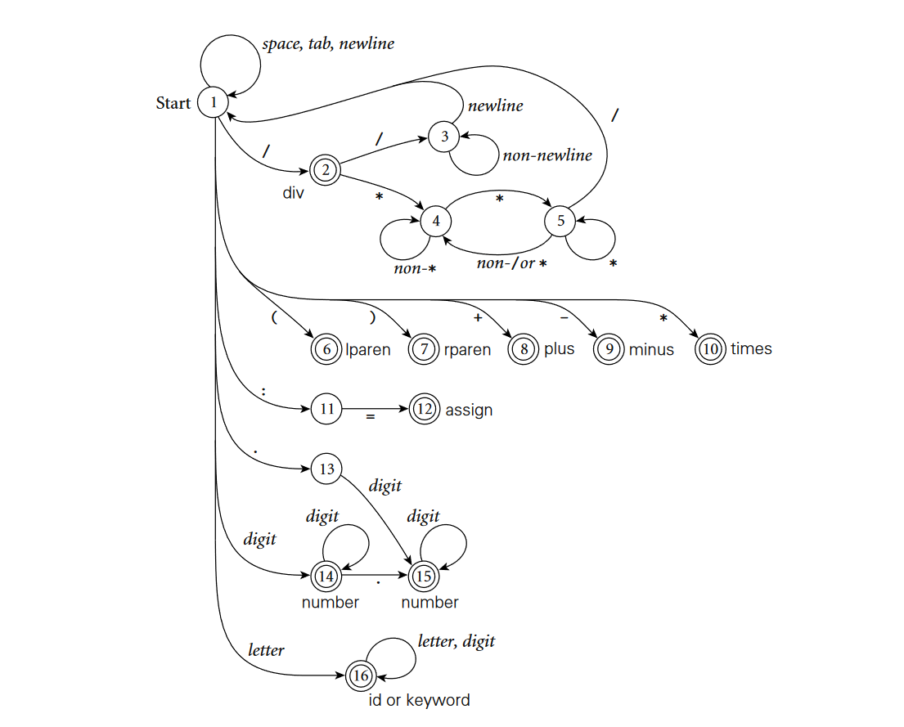
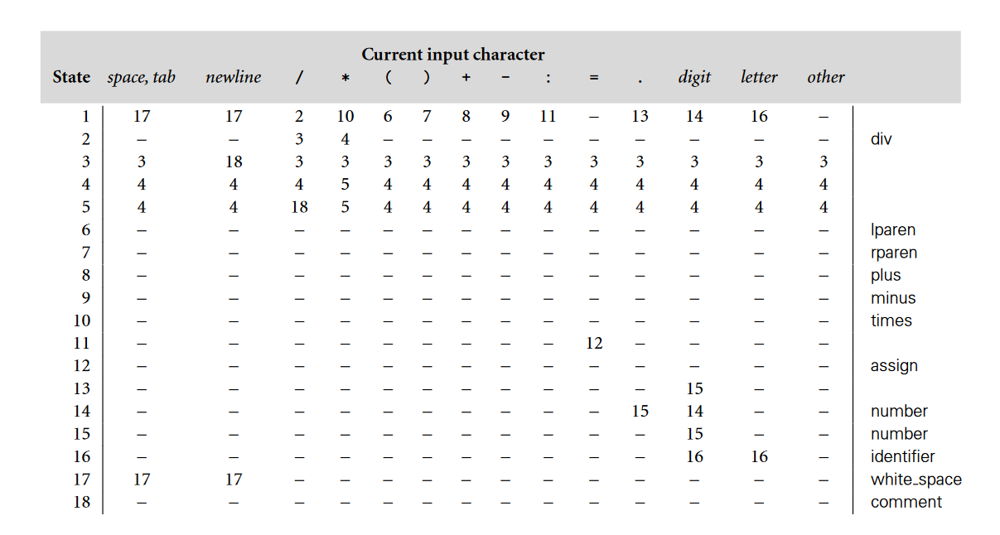

# Token Scanner

This is a `C++` representation of a token scanner using the concept of transition table. This is a project made for Concept of Programming Languages.

## Basis

This is based upon the transition table found in the book, *Programming Language Pragmatics, 4th Edition*

### Automaton Example

### Transition Table

